# 一、课前

## 1.自我介绍

 牟东海

来自华清远见沈阳中心


## 2.项目介绍

网络聊天室

C/S架构

C++语言		C with  class

同等条件下，编译型语言一定比脚本语言运行效率高。

编译型语言编译之后CPU执行

脚本语言，解析器执行，CPU执行解析器

C++难学

QT框架   做GUI的框架


## 3.上课方式

讲课使用讲练结合的方式

### 1）分组

8~10人一组，每组起一个文雅又响亮的名字。选组长。

分完组之后把分组表改成自己的组名，发给我。

各班班长统计本班的分组情况，下午上课之前QQ发给我。


### 2）得分

讲练结合。

每练都有加分。

一人得分全组加分，小组每名成员得分相同。每组最多五个人能给组加分。

全班第一加2分，其他加1分。


比如：

A 组   一共10人， 10人都做完了，加5分

B组  一共8人，5人做完，加5分


# 二、软件环境

QtCreator是QT官方提供的一个使用QT框架开发的IDE，个人认为不是很适合开发。为什么上课还要使用QtCreator呢？因为它非常适合学习QT。它继承了编辑器，编译器，界面设计器，还有API文档。


Qt是一个跨平台的开发框架，我们体验在windows开发，在linux运行。

## 1.QtCreator  Windows

课堂上主要使用windows版本的QtCreator。

安装路径不能有中文。


## 2.QtCreator  Linux

项目的阶段测试可以使用linux版本。将windows下开发的代码，移植到linux下，编译运行。

不能双击安装，要使用命令

添加可以执行权限  chmod +x qt.......

执行安装程序  ./qt......

ubuntu 16


# 三、C++多态

多态是一种思想，C++用若干语法支持多态。


## 1.虚函数的定义

成员函数。

```C++
virtual void eat()
{
	cout << “ eating ...” << endl; 
}
```


## 2.重写（覆盖）

虚函数的目的是为了重写。

### 示例1：

```C++
#include <iostream>
#include <string>

using namespace std;

class A
{
public:
    virtual void show(){//在A类中定义虚函数
        cout << "A show()..." << endl;
    }
};

/*
B类继承A类，我们成B是A的子类（派生类），A是B的父类（基类）
子类中会继承父类中的所有的成员，和放权限有没有关系？和访问权限没有关系。
父类中的私有成员，子类也继承了，只是子类对这个私有成员没有访问权限。
*/
class B:public A//定义B类继承A类
{
public:
    /*
    重写：子类中，定义和父类中的虚函数同名，同返回值类型，同参数列表的函数，叫重写。
    返回值类型，不一定完全相同，能匹配就行。当返回值是指针的时候，子类中重写的函数可以返回基类中
    函数返回值类型的派生类的指针。
    */
    void show()
    {
        cout << "B show()..." << endl;
    }
};

int main()
{
    A a;
    a.show();
    B b;
    b.show();
    return 0;
}
```

我们学习编程语言，最重要的不是记住语法，而是掌握每一种语法的使用情景。

重写为了实现多态。


## 3. C++的多态

### 多态的语法：

 多态不只一个语法。

这里我要强调的是运行时多态（动态绑定）。

C++还有静态多态，这里先不讨论。


子类继承父类，子类重写父类的中的虚函数，可以通过父类的指针或引用调用子类中重写的函数。


### 多态的目的：

 根据不同的参数执行不同的逻辑。


### 示例2：

```C++
#include <iostream>
#include <string>

using namespace std;

class Person
{
public:
	virtual void eat()//虚函数，允许重写
	{
		cout<<"Person eat"<<endl;
	}

	void sleep()//普通成员函数，不允许子类重写
	{
		cout<<"Person sleep"<<endl;
	}
};


class Student : public Person
{
public:
	void eat()//重写父类的函数
	{
		cout<<"student eat"<<endl;
	}

	void sleep()
	{
		cout<<"student sleep"<<endl;
	}
};

int main()
{
	Student xiaoming;//创建子类对象，在栈空间
	Person& p1 = xiaoming;//定义父类引用指向子类对象，引用就是别名
	p1.eat();//student eat
	p1.sleep();//person sleep

	Person* p2 = &xiaoming;//父类类型的指针指向子类对象
	p2->eat();//student eat
	p2->sleep();//person sleep
    return 0;
}
```

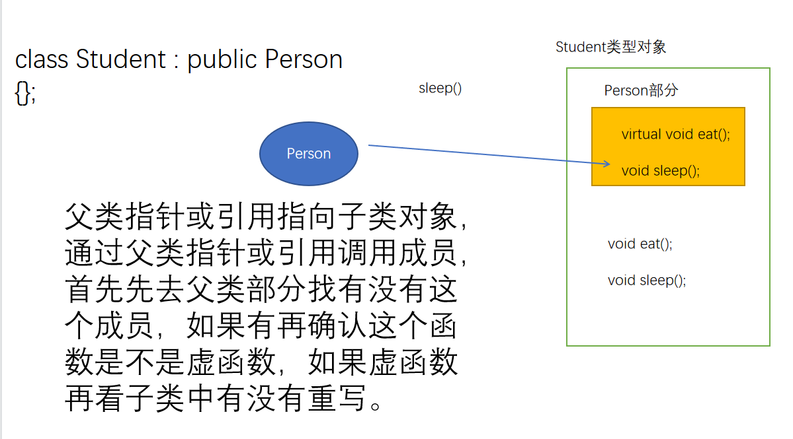

### 示例3：

模拟一个公司招聘功能

1.定义基类Developer，有虚函数develop();

2.定义大神类Manito和菜鸟类SmallBird 继承Developer，重写develop()函数

3.定义公司类Company  

​	1)定义成员函数招聘 recruit();

​	功能：随机生成一个开发者对象，返回值为Developer* (父类指针)

​	2)定义Company类的成员函数 work(Developer* );

​	功能：调用develop()函数；（重写函数）

​	例：Developer* recruit();

​	void work(Developer*);

4.main中创建Company对象，调用recruit()获得一个Developer，

​						 然后调用work()传入Developer参数

```C++
#include <iostream>
#include <time.h>
#include <stdlib.h>

using namespace std;

class Developer
{
public:
    /*
    当基类中的虚函数不需要写逻辑时，可以定义为纯虚函数，在函数的结尾加=0
    纯虚函数可以没有函数体，包含纯虚函数的类我们叫抽象类，抽象类不能实例化对象。
    */
    virtual void develop() = 0;//如果基类的虚函数没有逻辑需要写，应该怎么处理？可以定义为纯虚函数
};

class Manito : public Developer
{
public:
    void develop()
    {
        cout<<"Manito develop"<<endl;
    }
};

class SmallBird : public Developer
{
public:
    void develop()
    {
        cout<<"SmallBird develop"<<endl;
    }
};

class Company
{
public:  
    Developer* recruit()
    {
        //这里应该随机返回大神或者菜鸟对象
        srand(time(0));//初始化随机种子
        switch(rand()%2)
        {
        case 0:
            return new Manito;//基类的指针指向派生类的对象，这里要多态
        case 1:
            return new SmallBird;
        }
    }
    
    void work(Developer* dev)
    {
        //传入不同类型的对象，Manito或者SmallBird，这里执行不同的函数
        //这里就是多态
        dev->develop();
    }
};

int main()
{
    Company c;
    Developer* dev = c.recruit();//获得一个对象，Manito或者SmallBird
    c.work(dev);
    return 0;
}

```


# 四、Qt基础

犇　	

猋　

骉　

麤　　

毳　　

淼　	

掱　　

焱　　

垚　　

赑　

 

 


bēn

biāo

biāo

cū

cuì

miǎo

pá

yàn

yáo

bì


## 1.QT简介

1、Qt是一个1991年由Qt Company开发的跨平台C++图形用户界面应用程序开发框架。

跨平台：一次开发，可以在不同的平台编译，生成不同平台的可执行程序。

开源：开放源代码。


2、它既可以开发GUI（Graphical User Interface）程序，也可用于开发非GUI程序，比如控制台工具和服务器。

GUI：图形化的用户交互程序。


3、Qt是面向对象的框架，使用特殊的代码生成扩展（称为元对象编译器(Meta Object Compiler, moc)）

​	以及一些宏，Qt很容易扩展，并且允许真正地组件(控件)编程。


不同的C++编译器是不能编译Qt项目的。


4、Qt包括多达500个以上的C++类，还替供基于模板的collections，serialization，

​	file，I/O device，directory management，date/time类。甚至还包括正则表达式

​	的处理功能。


## 2.第一个Qt项目

### 1）创建项目

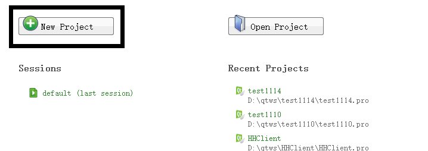

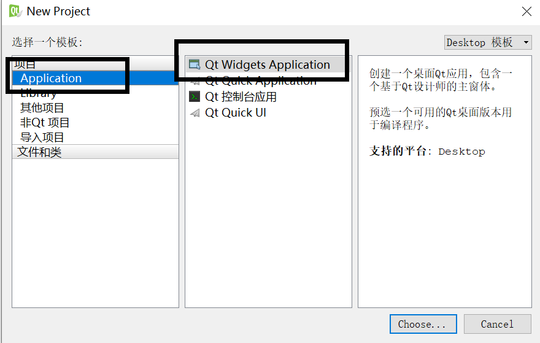

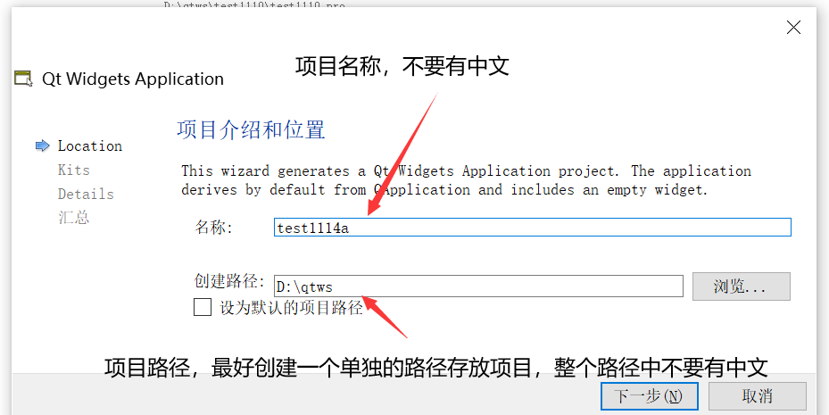

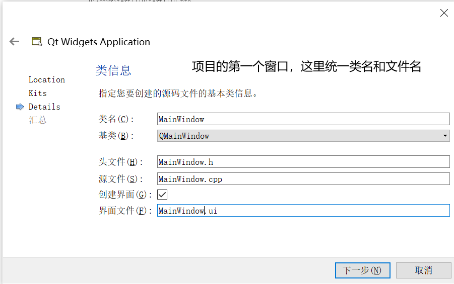


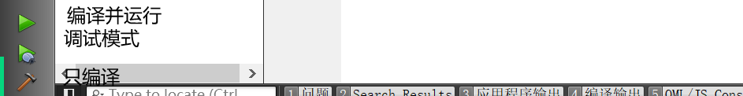


### 2）项目简介

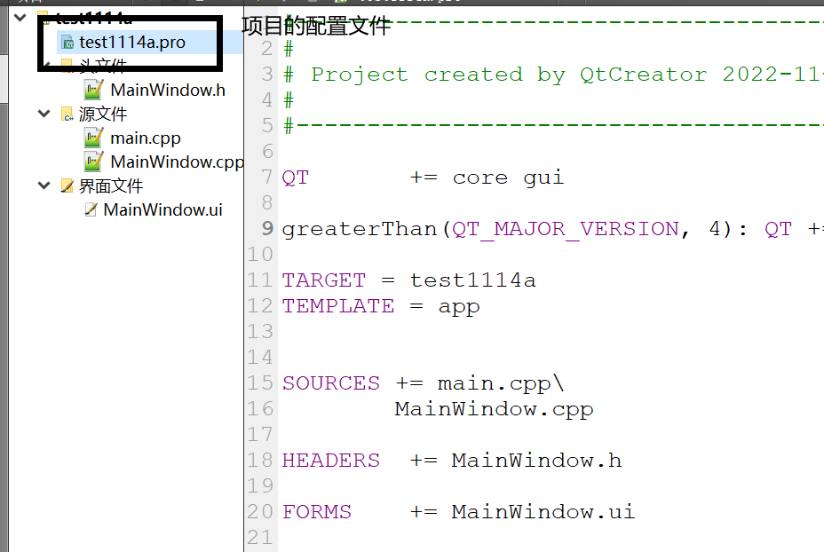

main.cpp

```C++
#include "MainWindow.h"
#include <QApplication>

int main(int argc, char *argv[])
{
    /*
    QApplication是QT的应用类，包含的内容很多。
    
    Qt中的类都是以Q开头的，为什么要这么命名呢？为了和我们自己写的类名字做区分。为了避免命名污染问题。
    C++的命名空间，专门为解决命名问题。
    Qt没有为自己定义命名空间，因为它给每个类的前面加了Q，就相当于使用了命名空间。
    这么做的好处容易兼容其他没有命名空间的语言，比如python
    */
    QApplication a(argc, argv);
    
    MainWindow w;//创建项目的第一个窗口对象
    w.show();//显示第一个窗口
    
    return a.exec();//执行应用
}
```

MainWindow.h

```C++
#ifndef MAINWINDOW_H
#define MAINWINDOW_H

#include <QMainWindow>

//声明.ui文件自动生成的类
namespace Ui {
class MainWindow;
}

/*
MainWindow是我们自己定义的类，继承了QMainWindow。
QMainWindow是Qt的主窗口类，为什么我们不直接创建QMainWindow对象，而要继承它呢？
在面向对象语言使用框架的时候，框架会给我们提供很多具备一定功能的类，但是这些类往往只有一些基本功能，不具备
我们项目中要求的特殊功能。所以我们要继承框架中的类，然后在此基础上添加自己项目中需要的特殊功能。

*/
class MainWindow : public QMainWindow
{
    //C++的class默认访问权限是private，struct的默认访问权限是public。class和struct在语法的区别就是默认访问权限不一样。
    //一般写逻辑的类用class，表示数据类型的类用struct
    Q_OBJECT//这是一个宏，它会定义一些QT元对象的属性。QT的元对象就是派生自QObject的类型。
    //QObject的派生类必须加Q_OBJECT宏，而且必须写在私有访问权限下
    
public:
    //构造函数，explicit防止对象的隐式转换，当构造函数只用一个实参就能匹配的时候会触发隐式转换。
    //隐式转换在绝大部分情况下都是不好的。
    //对函数形参初始化，叫默认参数，默认参数可以不给实参。
    //QWidget是QT中所有控件的基类，在窗口上能看到的都是控件。
    //parent涉及到了QT的内存管理机制。C++本身没有内存管理，所以C++的框架都会提供内存管理机制。
    //QT会构建一个树形结构，当根节点删除的时候，会把所有的子节点都删除。一般以窗口对象为根。
    //所以parent参数是执行MainWindow的父节点，为了构建一个管理生命周期的数。
    explicit MainWindow(QWidget *parent = 0);
    ~MainWindow();//析构函数
    
private:
    //Ui::MainWindow是.ui文件自动生成的类，ui指针将指向有Ui::MainWindow创建的对象，我们对界面文件中
    //创建的所有的控件对象的操作都通过ui指针。
    Ui::MainWindow *ui;
};

#endif // MAINWINDOW_H

```

MainWindow.cpp

```C++
#include "MainWindow.h"
//根据.ui文件自动生成的文件，在项目的构建路径中，里面包含Ui::MainWindow类，是QtCreator帮我们完成的
#include "ui_MainWindow.h"


MainWindow::MainWindow(QWidget *parent) :
    QMainWindow(parent),//对父类部分进行初始化
    ui(new Ui::MainWindow)//创建界面文件对象
{
    ui->setupUi(this);//创建.ui文件中编辑的控件对象
}

MainWindow::~MainWindow()
{
    delete ui;//删除构造函数中创建的界面文件对象
}
```

MainWindow.ui是可视化的界面编译文件

layouts  布局，控件在窗口中的排列方式

spacers   占位控件，让两个控件之间产生距离

buttons  按钮

item views  条目控件(抽象类)

item widgets  条目控件(是item views的简单实现)

containers 容器控件，用于包含其他控件

input widgets  输入控件

display widgets 显示控件

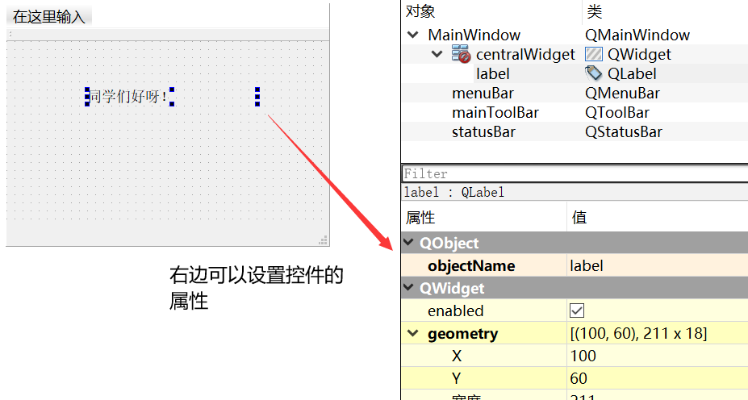


### 3.基础控件

#### 1）QLabel

可以显示文本和图片

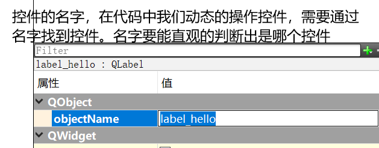


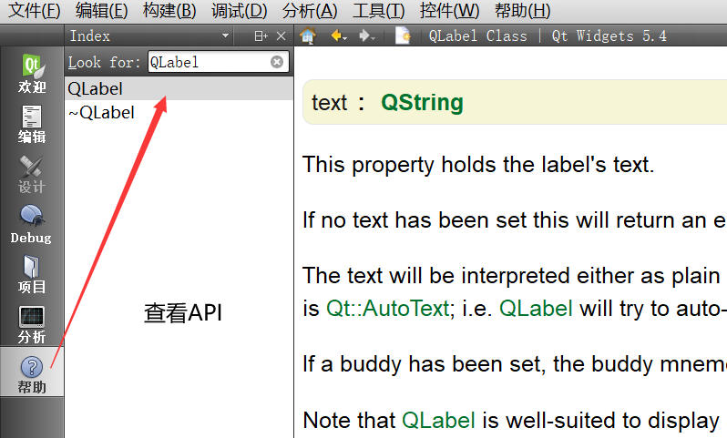

#### 2）QLineEdit

可以输入一行文本内容

#### 3）QPushButton

普通的按钮

#### 4）布局

线性布局

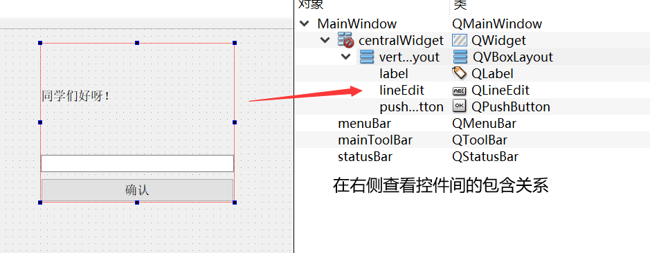

## 练习1：

做出登录界面。

输入框的暗文显示。


# 五、信号与槽

## 1.作用

解耦合

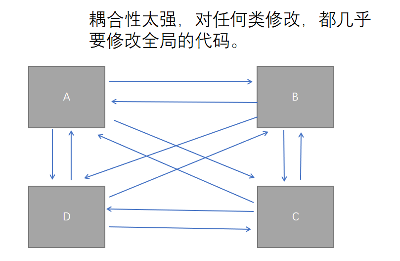


## 2.原理

观察者模式专门用来解耦合，Qt在底层为我们实现了一个观察者模式，叫信号与槽。

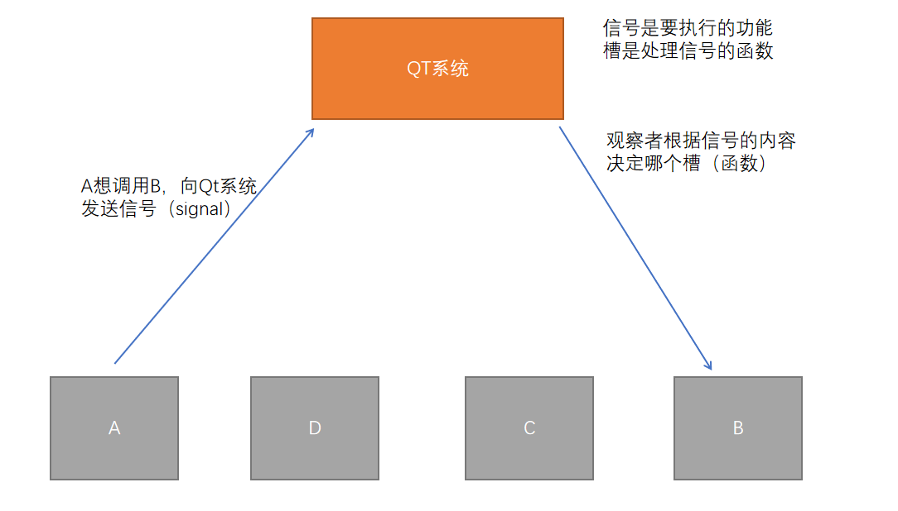


## 3.使用示例

点击QPushButton，将QLineEdit中输入的文本，显示在QLabel上。

点QPushButton被点击时，会发出一个信号，叫clicked

```C++
#include "MainWindow.h"
//根据.ui文件自动生成的文件，在项目的构建路径中，里面包含Ui::MainWindow类，是QtCreator帮我们完成的
#include "ui_MainWindow.h"


MainWindow::MainWindow(QWidget *parent) :
    QMainWindow(parent),//对父类部分进行初始化
    ui(new Ui::MainWindow)//创建界面文件对象
{
    ui->setupUi(this);//创建.ui文件中编辑的控件对象
    //因为label_hello是在.ui文件中编辑的，所以使用它需要通过ui
    ui->label_hello->setText("同学们下午好!");
    
    /*
    连接信号与槽的函数，有5个参数，参数5先不管
    参数1：发出信号的对象
    参数2：信号 SIGNAL宏
    参数3：接收信号的对象
    参数4：处理信号的参函数  SLOT宏
    
    注意：信号和槽后面都有一对圆括号
    SIGNAL(clicked())
    SLOT(testSlot())
    */
    //this指针只能用于成员函数，指向调用成员函数的对象
    connect(ui->pushButton_hello, SIGNAL(clicked()), this, SLOT(testSlot()));
}

MainWindow::~MainWindow()
{
    delete ui;//删除构造函数中创建的界面文件对象
}

void MainWindow::testSlot()
{
    //QString类是QT定义的字符串处理类
    QString input = ui->lineEdit_hello->text();//获得输入的文本内容
    ui->label_hello->setText(input);
}
```

```C++
//头文件
private slots:
    //slots是定义槽函数的关键字，这是QT的关键字，C++编译器会报错的
    //private是槽函数的访问权限，槽函数的用法仅比普通函数多一个可以处理信号的功能。
    void testSlot();
```


## 练习2：

制作两个QLabel，分别是label_1  label_2，和两个QPushButton，pushButton_1 pushButton_2，点击pushButton_1在label_1上显示“你好”，点击pushButton_2在label_2上显示 “呀”。

```C++
#ifndef MAINWINDOW_H
#define MAINWINDOW_H

#include <QMainWindow>

namespace Ui {
class MainWindow;
}

class MainWindow : public QMainWindow
{
    Q_OBJECT
    
public:
    explicit MainWindow(QWidget *parent = 0);
    ~MainWindow();
    
private slots:
    void pushButton1Clicked();
    void pushButton2Clicked();
    
private:
    Ui::MainWindow *ui;
};

#endif // MAINWINDOW_H

```

```C++
#include "MainWindow.h"
#include "ui_MainWindow.h"

MainWindow::MainWindow(QWidget *parent) :
    QMainWindow(parent),
    ui(new Ui::MainWindow)
{
    ui->setupUi(this);
    connect(ui->pushButton_1, SIGNAL(clicked()), this, SLOT(pushButton1Clicked()));
    connect(ui->pushButton_2, SIGNAL(clicked()), this, SLOT(pushButton2Clicked()));
}

MainWindow::~MainWindow()
{
    delete ui;
}

void MainWindow::pushButton1Clicked()
{
    ui->label_1->setText("你好");
}

void MainWindow::pushButton2Clicked()
{
    ui->label_2->setText("呀");
}

```


## 练习3：

制作登录界面，判断登录是否成功，并在界面上显示成功或者失败的信息。

用户名 admin

密码   abc123

QString如何判断字符串相等。QString为什么要重载运算符？

重载运算符本质就是定义函数，为什么不定义函数，而要重载运算符，目的是让代码变得更优雅。

==

```C++
#ifndef MAINWINDOW_H
#define MAINWINDOW_H

#include <QMainWindow>

namespace Ui {
class MainWindow;
}

class MainWindow : public QMainWindow
{
    Q_OBJECT
    
public:
    explicit MainWindow(QWidget *parent = 0);
    ~MainWindow();
    
private slots:
    void loginClicked();
private:
    Ui::MainWindow *ui;
};

#endif // MAINWINDOW_H

```

```C++
#include "MainWindow.h"
#include "ui_MainWindow.h"

MainWindow::MainWindow(QWidget *parent) :
    QMainWindow(parent),
    ui(new Ui::MainWindow)
{
    ui->setupUi(this);
    connect(ui->pushButton_login, SIGNAL(clicked()), this, SLOT(loginClicked()));
}

MainWindow::~MainWindow()
{
    delete ui;
}

void MainWindow::loginClicked()
{
    QString user = ui->lineEdit_user->text();
    QString passwd = ui->lineEdit_passwd->text();    

    if(user=="admin" && passwd=="abc123")
    {
        ui->label_result->setText("登录成功");
    }
    else
    {
        ui->label_result->setText("登录失败");
    }
}

```

