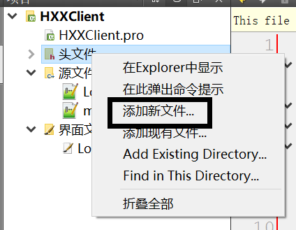
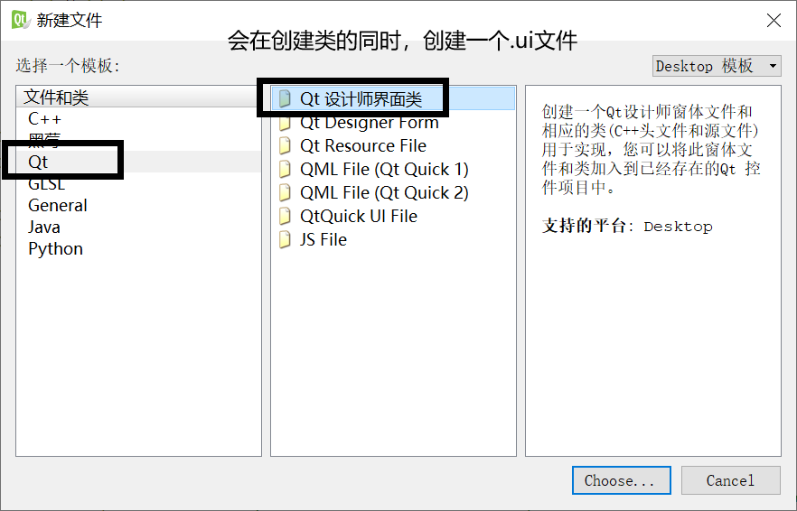
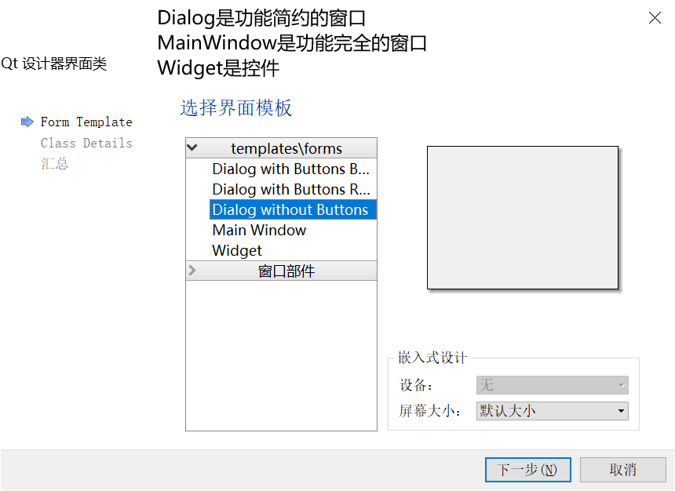
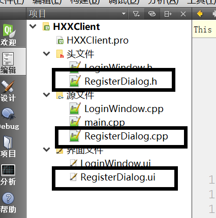
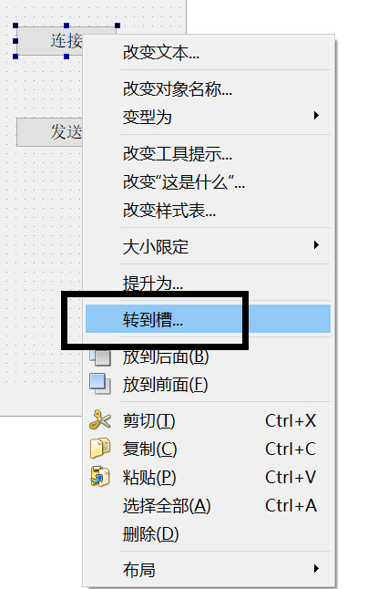
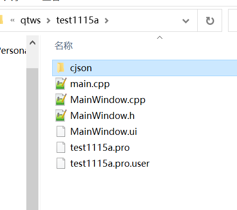
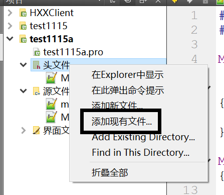
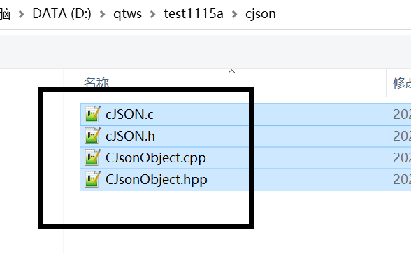
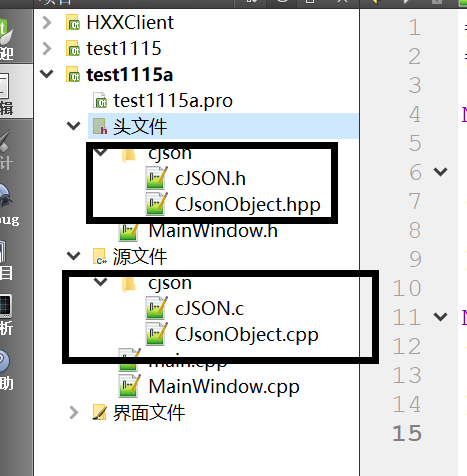
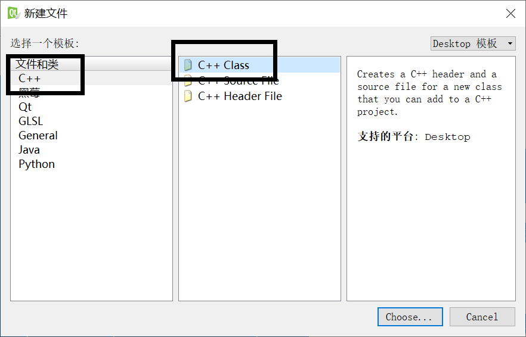

# 项目步骤1：

实现客户端的简单注册功能。


## 知识点1：界面切换










```C++
void LoginWindow::onRegisterPushButtonClicked()
{
    //new+类型名表示在堆空间创建一个该类型的对象，返回一个指向该对象的指针。堆空间的对象没有名字。
    //this指向调用成员函数的对象，在这里this指向的是LoginWindow对象
    RegisterDialog* rd = new RegisterDialog(this);
    //显示窗口有两种方式
    //1.普通显示
    //rd->show();
    //2.模态显示
    rd->exec();//程序会阻塞，等界面关闭，才继续执行，使用模态显示，必须指定父节点.
}
```

new是在堆空间创建对象。

对象可以被创建在内存的3个空间：堆  栈  静态

栈：普通的局部变量都在栈空间，占空间的对象是在对象所在作用域开始执行时创建对象，作用域执行结束时自动		删除对象。

堆：new创建对象，delete删除对象。对象的生命周期自定义。

静态：全局变量和staic修饰的局部变量在静态区，静态区的对象在第一次使用的时候创建，在程序结束后自动删		除对象。

堆、占、静态的本质区别是对象的生命周期管理不同。所以我们希望对象有什么样的生命周期就把对象放在哪个内存空间。

生命周期就是对象何时生，何时删除。


## 知识点2：QT的TCP客户端

### 1）添加配置

QT += network


### 2）QTcpSocket类

socket是系统给我们分配的用于tcp发送接收数据的资源。


```C++
QTcpSocket* socket = new QTcpSocket(this);// 创建socket对象，参数是父节点，用于内存管理
//连接服务端
//参数1：服务端的地址 QHostAddress类型是主机的地址类型，需要字符串类型的ip地址初始化
//参数2：是主机的端口号
/*
ip地址是以ip协议编写的网络地址，我们通过ip地址能够在网络中找到主机所在电脑。
端口号，是用来在主机电脑中识别服务端程序用的。
*/
socket>connectToHost(QHostAddress(ui->lineEdit->text()), 55555);//代码执行后不能马上连接成功

//当连接成功后会发出connected()信号
connect(socket, SIGNAL(connected()), this, SLOT(socket_connect()));
//当断开连接时会发出disconnected()信号
connect(socket, SIGNAL(disconnected()), this, SLOT(socket_disconnect()));
//当收到数据时会发出readyRead()信号
connect(socket, SIGNAL(readyRead()), this, SLOT(socket_read()));


void MainWindow::socket_read()
{
    QByteArray data = socket->readAll();//读取收到的所有数据，返回值是字节数组类型
    //QString::fromLocal8Bit(data)使用QString的静态成员函数fromLocal8Bit根据QByteArray创建QString对象，前提是字节数组中的数据真的是字符串。
    ui->textBrowser->append(QString::fromLocal8Bit(data));
}

void MainWindow::on_pushButton_send_clicked()
{
    QString data = ui->lineEdit_msg->text();
    //data.toLocal8Bit()将QStirng类型的对象转换成QByteArray类型对象，再调用
    //.data()函数获得QByteArray中指向数据的指针，char*类型 
    //.size()函数获得字节数组的长度，就是数据的字节数。
    socket->write(data.toLocal8Bit().data(), data.toLocal8Bit().size());
}
```


### 3）示例代码

给.ui文件中的控件添加槽函数有快捷方式。




```C++
#include "MainWindow.h"
#include "ui_MainWindow.h"
#include <QHostAddress>

MainWindow::MainWindow(QWidget *parent) :
    QMainWindow(parent),
    ui(new Ui::MainWindow)
{
    ui->setupUi(this);
    socket = new QTcpSocket(this);//创建QTcpSocket对象
    connect(socket, SIGNAL(connected()), this, SLOT(onConnect()));
    connect(socket, SIGNAL(disconnected()), this, SLOT(onDisconnect()));
    connect(socket, SIGNAL(readyRead()), this, SLOT(onReadyRead()));
    
}

MainWindow::~MainWindow()
{
    delete ui;
}

void MainWindow::onConnect()
{
    ui->label_receive->setText("连接成功");
}

void MainWindow::onDisconnect()
{
    
}

void MainWindow::onReadyRead()
{
    QByteArray data = socket->readAll();
    ui->label_receive->setText(QString::fromLocal8Bit(data));
}

void MainWindow::on_pushButton_connect_clicked()
{
    QString ip = ui->lineEdit_ip->text();//获得输入的ip
    //QHostAddress(ip)创建匿名对象，初始化、赋值、实参时经常使用匿名对象
    //连接ip地址为ip的12345端口的服务端
    socket->connectToHost(QHostAddress(ip), 12345);
}

void MainWindow::on_pushButton_send_clicked()
{
    QString msg = ui->lineEdit_msg->text();
    QByteArray data = msg.toLocal8Bit();//将发送的字符串转换成字节数组等待发送
    socket->write(data.data(), data.size());
}

```


## 练习1：

实现客户端和网络助手的收发功能


## 知识点3：json和消息类的封装

### 1）什么是json

比如现在有一个用户  账号  100001   密码 123abc  昵称 小明

"100001123abc小明"这样的字符串发给服务器可以吗？不行，因为无法区分数据的种类。

"100001,123abc,小明"这样可以吗？可以，因为具备简陋的格式，可以加以解析。但是由于格式过于简陋，字符		串携带数据不灵活。


json是一种广泛用于网络传输的字符串格式。

```
{"userid":"100001", "passwd":"123abc", "nickname":"小明"} //表示一个人的信息

//一个包含3个人信息的数组
[{"userid":"100001", "passwd":"123abc", "nickname":"小明"}, 
{"userid":"100002", "passwd":"123abc", "nickname":"小红"},
{"userid":"100003", "passwd":"123abc", "nickname":"小王"}]
```

json有两种容器，对象容器  { } ，数组容器  [ ]。

容器中可以存放C++所有的基本类型以及string类型的数据。

对象容器通过数的key获得其中的数据。

数组容器通过角标（0~N-1）获得其中的数据。


json格式的字符串简称json串。

为什么使用json串，而不用一定格式的数据帧，因为我们的聊天项目很难预估用户的一条数据要携带多少字符。

### 2）cjson库

是json的一款解析库，市面上json的解析库非常多。

发给大家的cjson库是源码。不需要安装，只需要把源码放在项目里就可以了。


将cjson源码拷贝到项目中。



选择添加现有文件




全选cjson的头文件和源文件






```C++
//CJsonObject是我们用于解析和构建json串的对象。我们所有得操作都是针对CJsonObject对象的。

CJsonObject();//无参构造函数用于构建json串
CJsonObject(const std::string& strJson);//有参构造函数用于解析json串

//常函数，常函数中不能对成员变量进行修改
std::string ToString() const;//将构建好的CJsonObject对象转换成json串
//当有多个功能相似的函数时，应该使用函数重载。
//下面这组Get函数是从对象容器中根据key读取value。
/*
在C/C++中，出现在声明语句中的符号都不是运算符，而是用来表达标识符身份的符号。
在C++中能在声明语句中出现的符号只有4个。这4个符号可以组合出各种类型。
*  表示指针变量
[]  表示数组
()  表示函数
&  表示引用
int a;  //整型变量a
int* a; //a是int类型指针
int a[10];//a是int类型数组
int a();//a是函数
int& a;//a是引用

参数1使用引用，是为了避免复制。
参数2使用引用，是为了实现输出参数。通过参数2将函数产生的结果传给主调函数。
返回值用来表示函数是否执行成功。
*/
bool Get(const std::string& strKey, CJsonObject& oJsonObject) const;
bool Get(const std::string& strKey, std::string& strValue) const;
bool Get(const std::string& strKey, int32& iValue) const;
bool Get(const std::string& strKey, uint32& uiValue) const;
bool Get(const std::string& strKey, int64& llValue) const;
bool Get(const std::string& strKey, uint64& ullValue) const;
bool Get(const std::string& strKey, bool& bValue) const;
bool Get(const std::string& strKey, float& fValue) const;
bool Get(const std::string& strKey, double& dValue) const;

/*
下面这组Get函数是在数组容器中获得数据.
参数1是数据的角标（0~N-1）。
*/
CJsonObject& operator[](unsigned int uiWhich);//运算符重载
bool Get(int iWhich, CJsonObject& oJsonObject) const;
bool Get(int iWhich, std::string& strValue) const;
bool Get(int iWhich, int32& iValue) const;
bool Get(int iWhich, uint32& uiValue) const;
bool Get(int iWhich, int64& llValue) const;
bool Get(int iWhich, uint64& ullValue) const;
bool Get(int iWhich, bool& bValue) const;
bool Get(int iWhich, float& fValue) const;
bool Get(int iWhich, double& dValue) const;

/*
下面这组Add函数是向对象容器中添加数据
*/
bool Add(const std::string& strKey, const std::string& strValue);
bool Add(const std::string& strKey, int32 iValue);
bool Add(const std::string& strKey, uint32 uiValue);
bool Add(const std::string& strKey, int64 llValue);
bool Add(const std::string& strKey, uint64 ullValue);
bool Add(const std::string& strKey, float fValue);
bool Add(const std::string& strKey, double dValue);

/*
下面这组Add函数是向数组容器中添加数据
*/
bool Add(CJsonObject&& oJsonObject);
bool Add(const std::string& strValue);
bool Add(int32 iValue);
bool Add(uint32 uiValue);
bool Add(int64 llValue);
bool Add(uint64 ullValue);
bool Add(int iAnywhere, bool bValue);
bool Add(float fValue);
bool Add(double dValue);
```

Add函数向CJsonObject对象中添加数据，然后生成json串。

Get函数解析json串，从CJsonObject对象中获得数据。

.hpp是head plus plus，头文件中可以写源代码。一般三方库的头文件多用hpp，在编译上有一定的优势，我们还当普通的头文件来用就可以。

### 3）示例代码

```C++
void MainWindow::on_pushButton_json_clicked()
{
    QString userid = ui->lineEdit_userid->text();
    QString passwd = ui->lineEdit_passwd->text();
    
    CJsonObject obj;//创建空的CJson对象
    //对象容器{}
    //userid.toStdString()将QString类型转换成C++string，因为CJson库不支持QT
//    obj.Add(std::string("userid"), userid.toStdString());
//    obj.Add(std::string("passwd"), passwd.toStdString());
//    std::string json = obj.ToString();//转成C++字符串
//    QString qjson(json.c_str());//转成QString类型，因为在QT中更支持QString
    //数组容器[]
    obj.Add(userid.toStdString());
    obj.Add(passwd.toStdString());
    std::string json = obj.ToString();
    QString qjson(json.c_str());//c_str是将C++string转成char*，因为QString不支持C++string
    ui->label_json->setText(qjson);
}
```


### 4）json封装

程序的一个固定的功能应该封装到专门的类中，这样方便后期的扩展和代码的维护。

因为这个类和QT没有关系，是专门对CJson的封装。所以创建普通C++类。



注册用户，需要向服务器发送什么数据？  昵称  密码   头像id   服务器返回给我们  账号

聊天，需要向服务器发送什么数据？用户id和发送的信息内容

为了完成不同的功能，要向服务器发送不同种类的数据。

所以我们要给我们发送的json串添加一个标识，因为不同功能的数据种类不一样，解析方式也不一样。

假设  0表示注册

1表示登录

2 表示私聊


