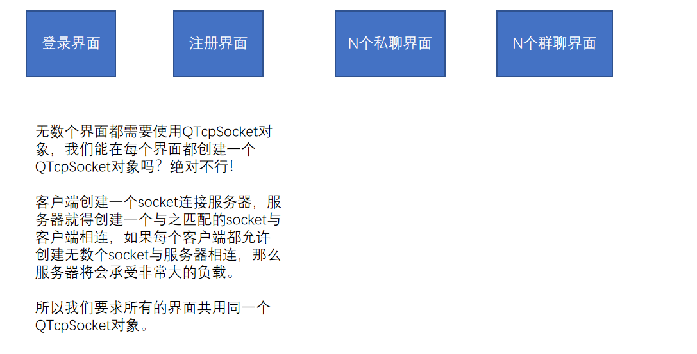
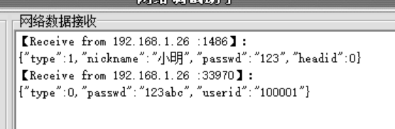

# 项目步骤1：

实现客户端简单的注册功能


## 知识点4：socket封装



如何让所有的界面共用同一个QTcpSocket对象？

定义一个全局的QTcpSocket对象？虽然可以实现，但是存在风险，因为不能保证后面的代码中不再去创建QTcpSocket对象。

使用设计模式——单例模式解决这个问题。

单例模式设计的类，只能创建出唯一的对象。单例模式是所有的设计模式中最容易实现的一种。

### 单例模式示例代码

```C++
#include <iostream>

using namespace std;

/*
将Socket类设计成单例模式
1 在类的外部不能创建Socket对象，也不允许累的外部拷贝对象
    私有化构造函数，使得类的外部不能创建Socket对象
    私有化拷贝构造函数，使得类的外部不能拷贝Socket对象
2 既然类的外部不让创建对象，那唯一的那个对象如何而来呢？
    我们要在 类的内部（类的成员函数就是类的内部）创建对象。
3 类的成员函数需要使用类的对象才能调用，既然类的外部没有对象，那如何调用
    类的成员函数来创建对象呢？静态成员函数不需要对象就能调用！
4 如果我们在静态成员函数getInstance中创建对象，是不是每次调用getInstance函数都会创建出一个对象呢？\
    我们需要定义一个变量，标识getInstance函数是否是第一次调用，只有第一次调用才创建对象。
5 用作标识的变量，应该是局部的还是成员的？
    应该是成员的，因为函数结束后，变量还得活着。
6 静态成员函数能调用普通的成员变量吗？
    不能！因为静态成员函数的调用不需要对象，所以在静态成员函数中没有this指针，因为没有this指针所以
    静态成员函数中不能使用普通的成员变量和成员函数。所以用作标识的变量我们要定义成静态成员变量。
*/
class Socket
{
private:
    Socket(){}//私有构造函数
    Socket(const Socket& other){}//私有拷贝构造函数
    static Socket* instance;//用作标识的成员变量，初始值是空指针
public:
    //函数返回Socket类型的指针
    static Socket* getInstance()
    {
        if(instance == 0)//说明函数没有执行过，也就没创建过对象
        {
            instance = new Socket();
        }
        return instance;
    }
};

Socket* Socket::instance = 0;//静态成员变量需要在类的外部初始化

int main()
{
    //Socket s;//报错
    //Socket* s = new Socket();//报错
    Socket* s1 = Socket::getInstance();//这是唯一的创建对象的方式
    Socket* s2 = Socket::getInstance();
    Socket* s3 = Socket::getInstance();
    cout<<s1<<" "<<s2<<" "<<s3<<endl;//因为是同一个对象，所以输出的地址相同
    //Socket* s4 = new Socket(*s1);//尝试拷贝  报错
    return 0;
}
```


### 命名规范

Qt使用的命名规范是驼峰命名法，驼峰命名法是很流行的命名方法，我们也使用。

每个单词的首字母大写

大驼峰   整个名称的首字母大写   类型名使用大驼峰   UserSosket

小驼峰   整个名称的首字母小写   变量和函数名使用小驼峰   userSocket


# 项目步骤2：

实现客户端简单的登录功能





