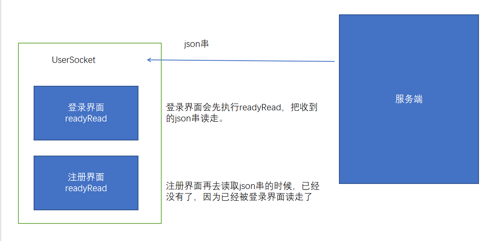
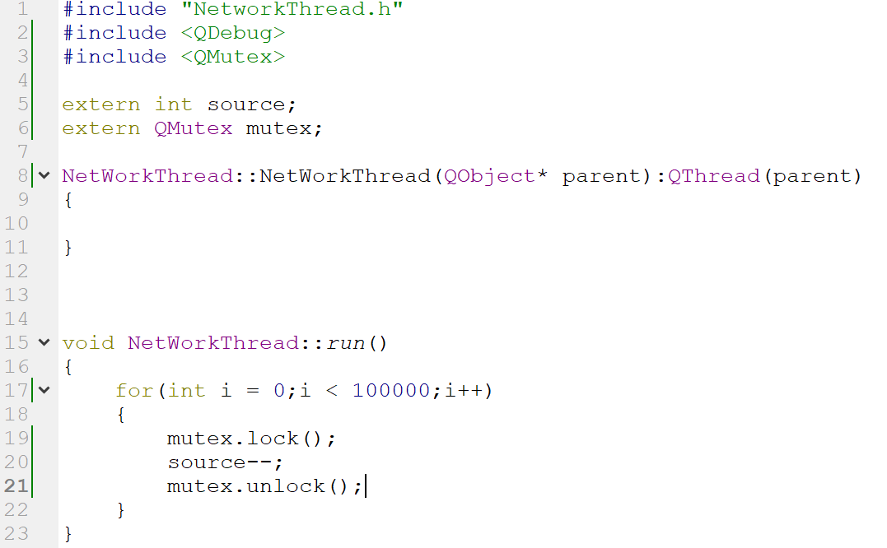
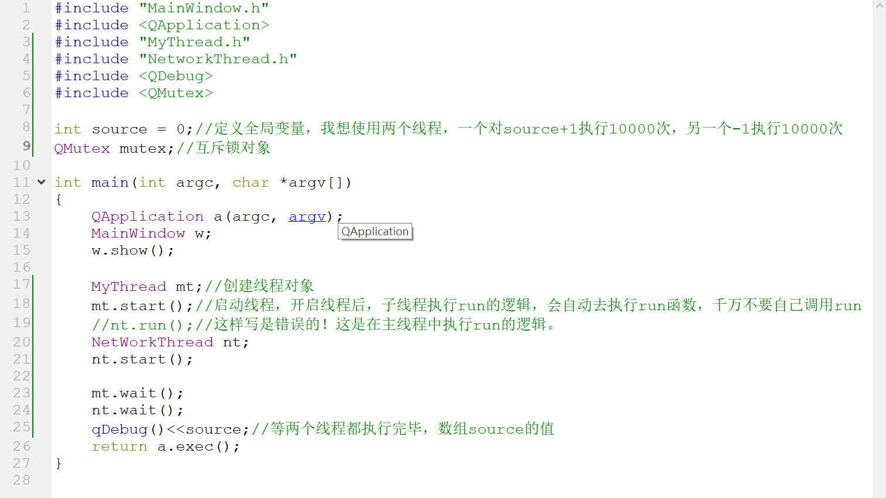
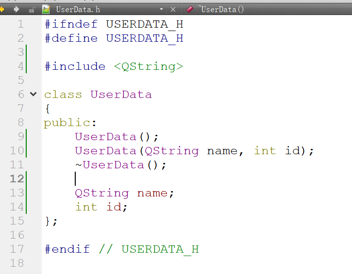
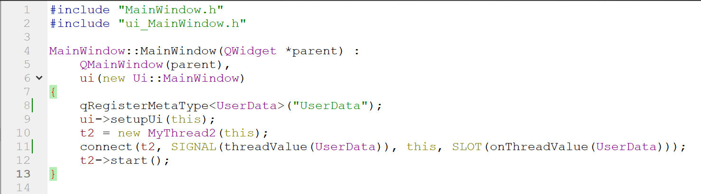
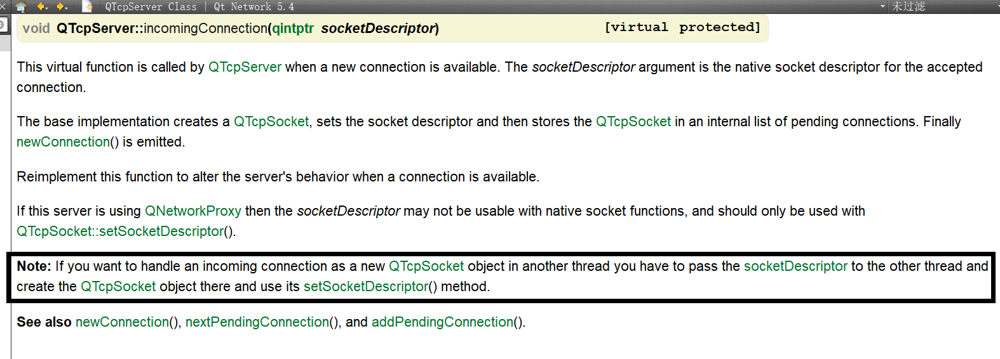

# 项目步骤4：

完成客户端简单的登录功能




解决bug的核心思想，登录界面和注册界面同时只能有一个界面连接UserSocket的readyRead信号。


# 项目步骤5：

多线程并发服务器


## 知识点1：QT的线程

线程是执行逻辑的单位。

进程是程序的资源管理，进程中必然至少包含一个线程。进程自带的线程我们称为主线程。

### 1）创建线程

QThread

1. 继承QThread
2. 重写run函数，就是线程要执行的逻辑。


### 2）互斥

线程之间是同时运行，在多个线程对同一个资源进行写操作时，有可能出现覆盖的问题，俗称争抢资源，会导致运行结果异常。

所以当多个线程对同一个资源写操作时，我们需要互斥。读操作不需要互斥。

QMutex

谁先抢到资源，谁上锁，其他线程等待，解锁后再次争抢。






## 知识点2：自定义信号

### 1）自定义信号的定义与发送

QPushButton   clicked信号

QTcpSocket   readyRead信号

上面都是QT给我们定义好的信号，我们也可以自己定义信号。

```C++
#ifndef MYTHREAD2_H
#define MYTHREAD2_H

#include <QThread>

class MyThread2 : public QThread
{
    Q_OBJECT
public:
    MyThread2(QObject* parent = 0);
    void run();
    
signals://定义信号的关键字，因为信号不是函数，不可以调用，所以没有访问权限。
    //我们定义信号，可以按照函数声明的语法，千万不要实现信号的函数，信号的参数可以随意定义
    void threadValue(int val);
};

#endif // MYTHREAD2_H

```

```C++
#include "MyThread2.h"

MyThread2::MyThread2(QObject* parent):
    QThread(parent)
{
    
}

void MyThread2::run()
{
    //让mainwindow中的label显示run中的i值，应该将i值传给MainWindow，使用信号传
    for(int i = 0;i < 10;i++)
    {
        //emit关键字是QT的关键字，用来发送信号。
        emit threadValue(i);//i作为信号的实参
        sleep(1);
    }
}
```


### 2）自定义信号跨线程发送自定义数据

```C++
qRegisterMetaType<自定义类型>("自定义类型");
```

要求自定义的数据类型有无参构造函数。






## 知识点3：自定义多线程QTcpServer

QTcpServer默认是不支持多线程的。

### 1）重写incomingConnection函数

```C++
void incomingConnection(qintptr socketDescriptor);
```




### 2）线程的event loop

```C++
QTcpSocket socket;
socket.setSocketDescriptor(socketDescriptor);
connect(&socket, SIGNAL(readyRead()), this, SLOT(readyRead()));
connect(&socket, SIGNAL(disconnected()), this, SLOT(disConnected()));
while(isRun)
{
    if(isRead)
    {
        QByteArray bdata = socket.readAll();
        QString data = QString::fromLocal8Bit(bdata);
        qDebug()<<data;
        isRead = false;
    }
    socket.waitForReadyRead(10);
}
```


