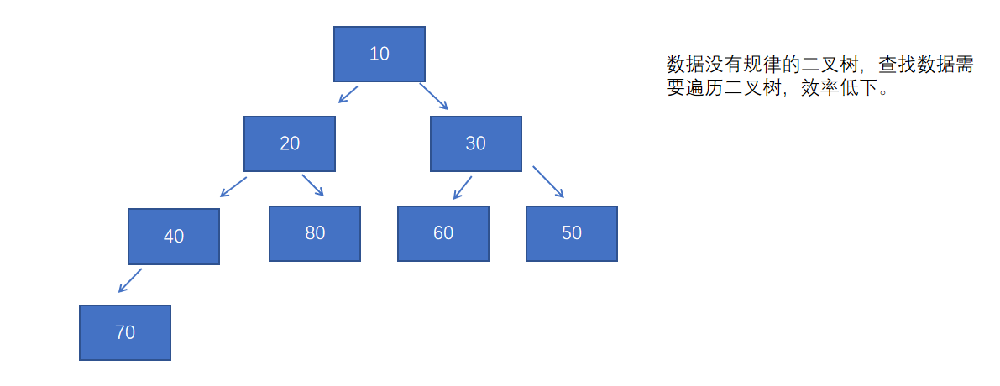
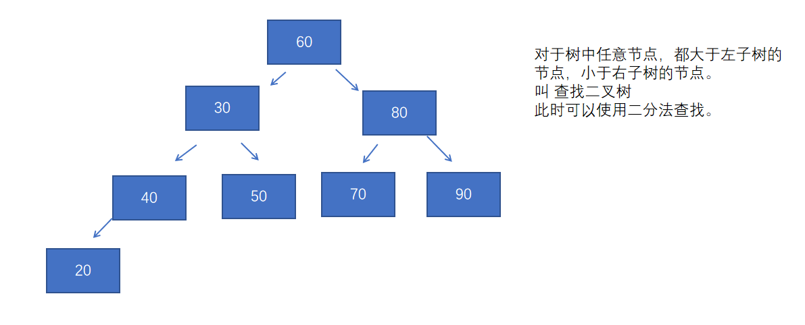
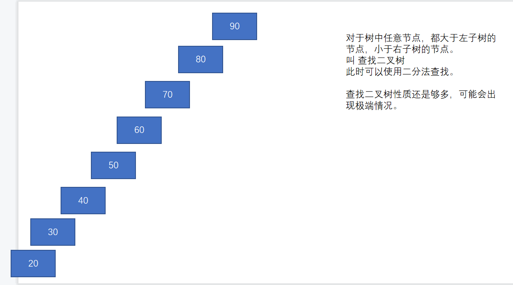
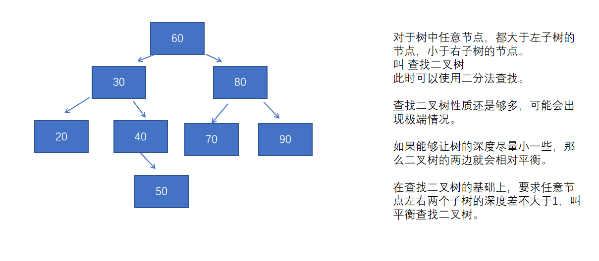

# 项目步骤5：

多线程并发服务器，完成注册功能


## 知识点3：C++STL——queue

STL   standard   template   library标准模板库，封装的常见的数据结构和一些排序查找的算法。

queue是队列。


线程中的逻辑，有两种情况触发：

1. 线程收到socket的数据
2. 主线程触发子线程逻辑，用户A给用户B发送私聊信息。需要用户A的线程把数据发给用户B的线程，此时需要通过主线程，主线程进行消息的转发。

所以子线程中的逻辑不是有同一个线程触发的。所以会有一种可能，子线程的任务还没处理完，主线程就要触发子线程逻辑。此时需要任务排队，等待子线程处理。


# 项目步骤6：

服务端登录功能完善，登录成功后返回在线人员的列表。


子线程向主线程通信，使用信号。

主线程向子线程通信，调用子线程函数。在子线程函数中要对任务队列互斥。


## 知识点1：C++STL——vector

是对数组的封装，可以实现长度的自增长。

查找时间复杂度是O(N)

vector先创建一个一定长度的数组，如果数组不够长了，再创建一个更长的新数组，将旧数组中的数据拷贝到新数据中。

所有的容器都是围绕增、删、改、查进行的封装。

```C++
#include <iostream>
#include <vector>

using namespace std;


int main()
{
    vector<int> v;
    v.push_back(10);
    v.push_back(13);
    v.push_back(30);
    v.push_back(12);
    v.push_back(11);
    v.push_back(40);//向尾部插入数据
    
    //当函数的返回值是引用类型时，函数的返回值才能被赋值
    v[2] = 300;//v[2]是运算符重载，实际上是在调用一个函数，那么v[2] = 300;就是在对函数的返回值赋值
    
    for(int i = 0;i < v.size();i++)
    {
        cout<<v[i]<<endl;
    }
    return 0;
}
```


## 知识点2：C++STL——map

map封装的是红黑树。

map查找的时间复杂度是O(logN)

普通二叉树




查找二叉树

查找二叉树的极端情况



平衡查找二叉树



但是，平衡查找二叉树虽然查找效率很高，但是为了维持平衡，每次插入新节点的时候，大概率都会进行调整，所以在插入和删除节点的时候效率低。

于是有了红黑树，红黑树基于平衡查找二叉树，添加了一些性质（略），牺牲一定的平衡性，检查输入删除时的调整次数，提升插入删除时的效率；同时要求左右两个子树的深度差不大于2倍，平衡性并没有被极大的牺牲，所以查找效率依然很高。

红黑树中的每个节点，在增、删、改、查的操作中，都需要比较。

### pair类

```C++
#include <iostream>
#include <map>

using namespace std;

int main()
{
    pair<int, string> p(10, "xiaoming");//只能存一对数据
 
    //first是第一个数据，int类型
    //second是第二个数据，string类型
    cout<<p.first<<" "<<p.second<<endl;
    return 0;
}
```

map中存放的数据是pair对象，而且是以pair对象中的first进行排列。

所以我们称first为map中的key（键）

称second为map中的value（值）

```C++
#include <iostream>
#include <map>

using namespace std;

int main()
{
    map<int, string> m;
    //插入pair对象，使用语法是匿名对象
    m.insert(pair<int, string>(1, "xiaoming"));
    m.insert(pair<int, string>(10, "xiaohong"));
    m.insert(pair<int, string>(8, "xiaoqiang"));
    m.insert(pair<int, string>(6, "xiaofang"));
    m.insert(pair<int, string>(5, "xiaowang"));
    //迭代器遍历，在编程中，只要提到迭代器就是用来遍历的，迭代器的本质是对指针的封装
    //iterator是map的内部类
    for(map<int,string>::iterator iter = m.begin();//让迭代器对象iter指向m的首元素
        iter != m.end();//只要iter没有指向m的尾部，循环就继续
        iter++)//移动迭代器指向m的下一个元素
    {
        //iter指向的每个元素都是一个pair对象，所以输出pair对象中的first和second
        cout<<iter->first<<" "<<iter->second<<endl;
    }
    
    return 0;
}

```


